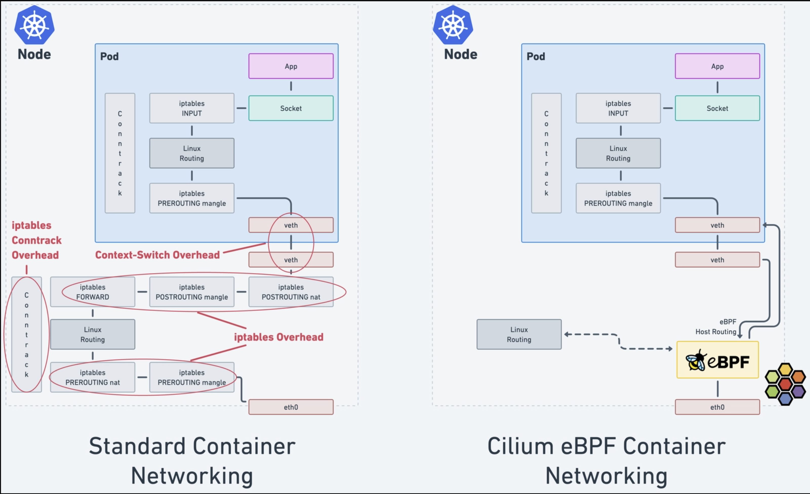

# 容器网络演进

* iptable
* ipvs
* cilium 





```
---> PRE_ROUTING ---> [Routing Decision] ---> FORWARD ---> [Routing Decision] ---> POST_ROUTING --->
                                  |                                   ^
                                  |                                   |
                                  v                                   |
                                 LOCAL_IN                        LOCAL_OUT
                                  |                                   ^
                                  |                                   |
                                  v                                   |
                                             LOCAL PROCESS

```

