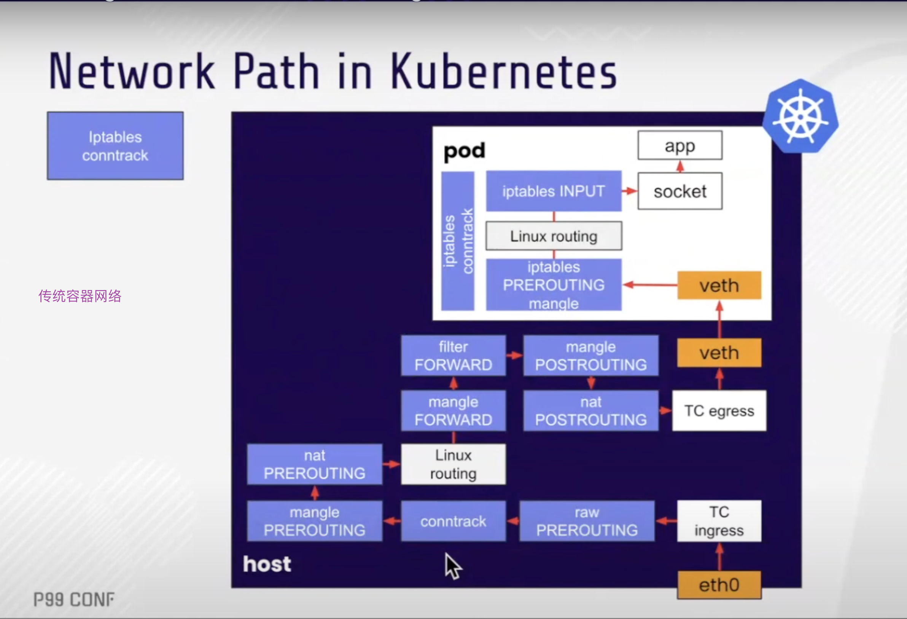
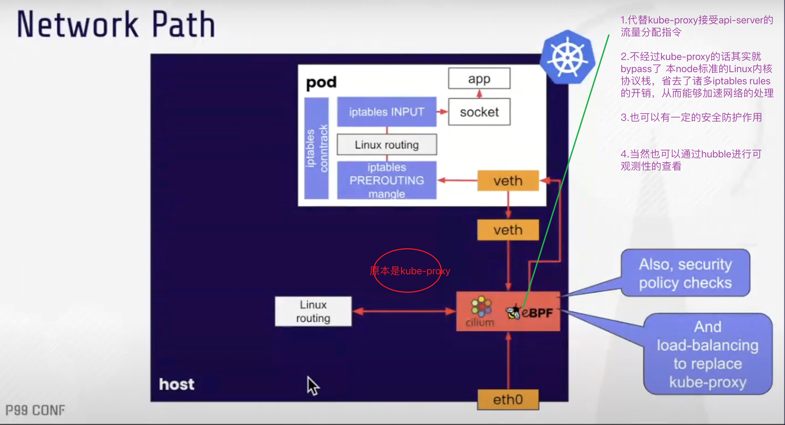

#  Cilium

# tranditional network vs cilium network

# Cilium Lab - solo [lab inside]
https://academy.solo.io/learn/courses/8/introduction-to-cilium/lessons   

---
#  Play with Cilium native routing in Kind cluster  
https://medium.com/@nahelou.j/play-with-cilium-native-routing-in-kind-cluster-5a9e586a81ca    

## Labs
https://labs-map.isovalent.com/  

## Migrating a cluster to Cilium
https://docs.cilium.io/en/stable/installation/k8s-install-migration/  